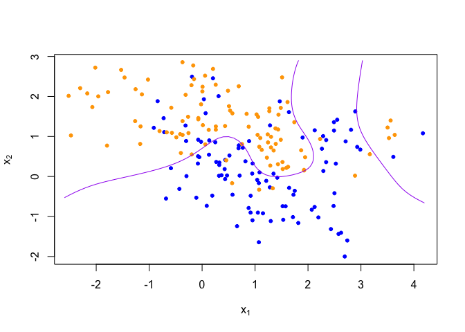
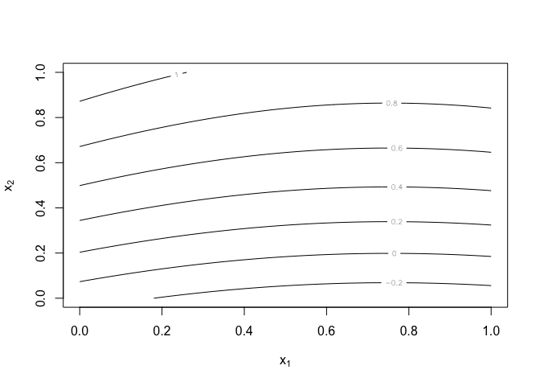
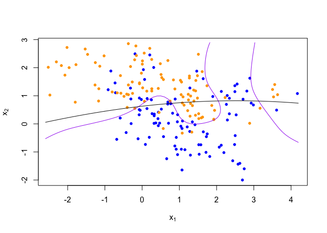

Homework 1
================
Qi Lin
January 19, 2023

``` r
library('class')
library('dplyr')
```

    ## 
    ## Attaching package: 'dplyr'

    ## The following objects are masked from 'package:stats':
    ## 
    ##     filter, lag

    ## The following objects are masked from 'package:base':
    ## 
    ##     intersect, setdiff, setequal, union

``` r
## load binary classification example data from author website 
## 'ElemStatLearn' package no longer available
load(url('https://web.stanford.edu/~hastie/ElemStatLearn/datasets/ESL.mixture.rda'))
dat <- ESL.mixture

plot_mix_data <- function(dat, datboot=NULL) {
  if(!is.null(datboot)) {
    dat$x <- datboot$x
    dat$y <- datboot$y
  }
  plot(dat$x[,1], dat$x[,2],
       col=ifelse(dat$y==0, 'blue', 'orange'),
       pch=20,
       xlab=expression(x[1]),
       ylab=expression(x[2]))
  ## draw Bayes (True) classification boundary
  prob <- matrix(dat$prob, length(dat$px1), length(dat$px2))
  cont <- contourLines(dat$px1, dat$px2, prob, levels=0.5)
  rslt <- sapply(cont, lines, col='purple')
}

plot_mix_data(dat)
```

<!-- -->

``` r
## fit linear classifier
fit_lc <- function(y, x) {
  df <- data.frame(y = y, x1 = x[,1], x2 = x[,2])
  fit <- lm(y~poly(x1,2) + poly(x2,2), data = df)
  return (fit)
}

## make predictions from linear classifier
predict_lc <- function(x, fit) {
  new.x.df <- data.frame(x1 = x[,1], x2 = x[,2])
  return (predict(fit,new.x.df))
}
```

``` r
## fit model to mixture data and make predictions
lc_beta <- fit_lc(dat$y, dat$x)
lc_pred <- predict_lc(dat$xnew, lc_beta)
```

``` r
## reshape predictions as a matrix
lc_pred <- matrix(lc_pred, length(dat$px1), length(dat$px2))
contour(lc_pred,
      xlab=expression(x[1]),
      ylab=expression(x[2]))
```

<!-- -->

``` r
## find the contours in 2D space such that lc_pred == 0.5
lc_cont <- contourLines(dat$px1, dat$px2, lc_pred, levels=0.5)

## plot data and decision surface
plot_mix_data(dat)
sapply(lc_cont, lines)
```

<!-- -->

    ## [[1]]
    ## NULL

The more flexible model decreases the bias (sum of squares). It follows
the data points along the arc of the true relationship of x1 and x2.
However, it increases variance of the model. It would result in vastly
different sum of squares for different data.
