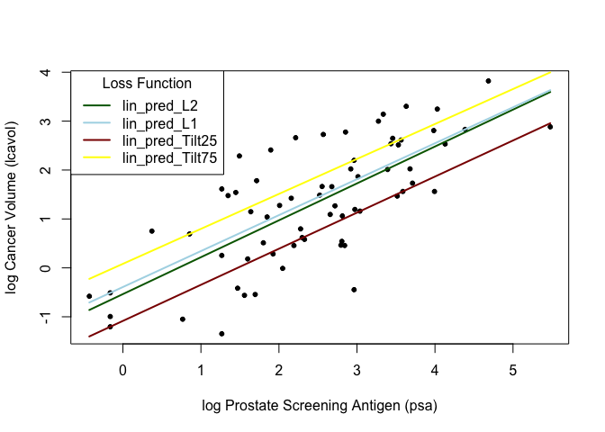
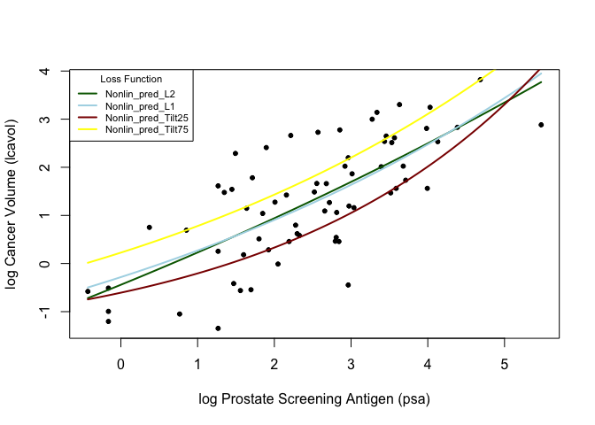

Homework 2
================
Qi Lin
January 22, 2023

``` r
## load prostate data
prostate <- 
  read.table(url(
    'https://web.stanford.edu/~hastie/ElemStatLearn/datasets/prostate.data'))

## subset to training examples
prostate_train <- subset(prostate, train==TRUE)

## plot lcavol vs lpsa
plot_psa_data <- function(dat=prostate_train) {
  plot(dat$lpsa, dat$lcavol,
       xlab="log Prostate Screening Antigen (psa)",
       ylab="log Cancer Volume (lcavol)",
       pch = 20)
}
plot_psa_data()
```

<!-- -->

1.  Write functions that implement the L1 loss and tilted absolute loss
    functions.

``` r
# L2 loss function
L2_loss <- function(y, yhat)
  (y-yhat)^2

# L1 loss function
L1_loss <- function(y, yhat)
  abs(y-yhat)

# Tilted absulute LF
Tilt_loss <- function(y, yhat, tau){
 tav = ifelse(y-yhat>0, tau*(y-yhat), (tau-1)*(y-yhat))
 return(tav)}
```

2.  Create a figure that shows lpsa (x-axis) versus lcavol (y-axis). Add
    and label (using the ‘legend’ function) the linear model predictors
    associated with L2 loss, L1 loss, and tilted absolute value loss for
    tau = 0.25 and 0.75.

``` r
# fit simple linear model using numerical optimization
fit_lin <- function(y, x, loss, beta_init = c(-0.51, 0.75),...) {
  err <- function(beta)
    mean(loss(y,  beta[1] + beta[2]*x,...))
  beta <- optim(par = beta_init, fn = err)
  return(beta)
}

# make predictions from linear model
predict_lin <- function(x, beta)
  beta[1] + beta[2]*x

# fit linear model
lin_beta_L2 <- fit_lin(y=prostate_train$lcavol,
                    x=prostate_train$lpsa,
                    loss=L2_loss)

lin_beta_L1 <- fit_lin(y=prostate_train$lcavol,
                    x=prostate_train$lpsa,
                    loss=L1_loss)

lin_beta_Tilt25 <- fit_lin(y=prostate_train$lcavol,
                    x=prostate_train$lpsa,
                    loss=Tilt_loss,
                    tau = 0.25)

lin_beta_Tilt75 <- fit_lin(y=prostate_train$lcavol,
                    x=prostate_train$lpsa,
                    loss=Tilt_loss,
                    tau = 0.75)

# compute predictions for a grid of inputs
x_grid <- seq(min(prostate_train$lpsa),
              max(prostate_train$lpsa),
              length.out=100)
lin_pred_L2 <- predict_lin(x=x_grid, beta=lin_beta_L2$par)
lin_pred_L1 <- predict_lin(x=x_grid, beta=lin_beta_L1$par)
lin_pred_Tilt25 <- predict_lin(x=x_grid, beta=lin_beta_Tilt25$par)
lin_pred_Tilt75 <- predict_lin(x=x_grid, beta=lin_beta_Tilt75$par)

# Create a figure

## plot data
plot_psa_data()

## plot predictions
lines(x=x_grid, y=lin_pred_L2, col='darkgreen', lwd=2)
lines(x=x_grid, y=lin_pred_L1, col='lightblue', lwd=2)
lines(x=x_grid, y=lin_pred_Tilt25, col='darkred', lwd=2)
lines(x=x_grid, y=lin_pred_Tilt75, col='yellow', lwd=2)

## Add legend
legend(
  "topleft",
  legend=c("lin_pred_L2", "lin_pred_L1", "lin_pred_Tilt25", "lin_pred_Tilt75"),
  col = c('darkgreen','lightblue','darkred','yellow'),
  title="Loss Function",
  lty = 1, lwd = 2)
```

<!-- -->

3.  Write functions to fit and predict from a simple nonlinear model
    with three parameters defined by ‘beta\[1\] +
    beta\[2\]*exp(-beta\[3\]*x)’. Hint: make copies of ‘fit_lin’ and
    ‘predict_lin’ and modify them to fit the nonlinear model. Use
    c(-1.0, 0.0, -0.3) as ‘beta_init’.

``` r
# fit simple NON linear model using numerical optimization
fit_Nonlin <- function(y, x, loss, beta_init = c(-1.0, 0.0, -0.3),...) {
  err <- function(beta)
    mean(loss(y, beta[1] + beta[2]*exp(-beta[3]*x),...))
  beta <- optim(par = beta_init, fn = err)
  return(beta)
}

# make predictions from Non-linear model
predict_Nonlin <- function(x, beta)
  beta[1] + beta[2]*exp(-beta[3]*x)

# fit Non-linear model
Nonlin_beta_L2 <- fit_Nonlin(y=prostate_train$lcavol,
                    x=prostate_train$lpsa,
                    loss=L2_loss)

Nonlin_beta_L1 <- fit_Nonlin(y=prostate_train$lcavol,
                    x=prostate_train$lpsa,
                    loss=L1_loss)

Nonlin_beta_Tilt25 <- fit_Nonlin(y=prostate_train$lcavol,
                    x=prostate_train$lpsa,
                    loss=Tilt_loss,
                    tau = 0.25)

Nonlin_beta_Tilt75 <- fit_Nonlin(y=prostate_train$lcavol,
                    x=prostate_train$lpsa,
                    loss=Tilt_loss,
                    tau = 0.75)

# compute predictions for a grid of inputs
x_grid <- seq(min(prostate_train$lpsa),
              max(prostate_train$lpsa),
              length.out=100)

Nonlin_pred_L2 <- predict_Nonlin(x=x_grid, beta=Nonlin_beta_L2$par)
Nonlin_pred_L1 <- predict_Nonlin(x=x_grid, beta=Nonlin_beta_L1$par)
Nonlin_pred_Tilt25 <- predict_Nonlin(x=x_grid, beta=Nonlin_beta_Tilt25$par)
Nonlin_pred_Tilt75 <- predict_Nonlin(x=x_grid, beta=Nonlin_beta_Tilt75$par)
```

4.  Create a figure that shows lpsa (x-axis) versus lcavol (y-axis). Add
    and label (using the ‘legend’ function) the nonlinear model
    predictors associated with L2 loss, L1 loss, and tilted absolute
    value loss for tau = 0.25 and 0.75.

``` r
# Create a figure

## plot data
plot_psa_data()

## plot predictions
lines(x=x_grid, y=Nonlin_pred_L2, col='darkgreen', lwd=2)
lines(x=x_grid, y=Nonlin_pred_L1, col='lightblue', lwd=2)
lines(x=x_grid, y=Nonlin_pred_Tilt25, col='darkred', lwd=2)
lines(x=x_grid, y=Nonlin_pred_Tilt75, col='yellow', lwd=2)

## Add legend
legend(
  "topleft",
  legend=c("Nonlin_pred_L2", "Nonlin_pred_L1", "Nonlin_pred_Tilt25", "Nonlin_pred_Tilt75"),
  col = c('darkgreen','lightblue','darkred','yellow'),
  title="Loss Function",
  lty = 1, lwd = 2, cex = 0.7)
```

<!-- -->
