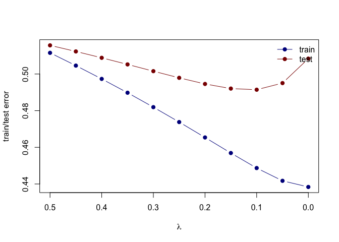
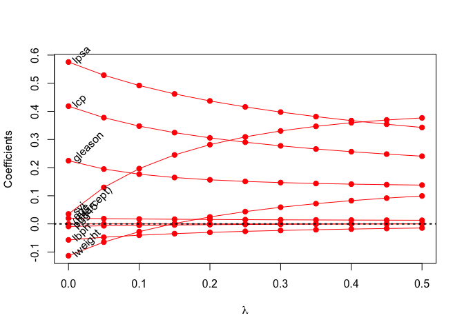

Homework 3
================
Qi Lin
February 13, 2023

``` r
library('splines')        ## for 'bs'
library('dplyr')          ## for 'select', 'filter', and others
library('magrittr')       ## for '%<>%' operator
library('glmnet')         ## for 'glmnet'
```

``` r
## load prostate data
prostate <- 
  read.table(url(
    'https://web.stanford.edu/~hastie/ElemStatLearn/datasets/prostate.data'))
```

-   Use the cor function to reproduce the correlations listed in HTF
    Table 3.1, page 50.

``` r
Cl <- round(cor(prostate),3)

#as.matrix(Cl)

Cl[upper.tri(Cl, diag = T)] <- ''

Cl.df <- as.data.frame(Cl)

Cl.df = Cl.df[-c(1,9,10),]%>% select(-c(pgg45,lpsa,train))

Cl.df
```

    ##         lcavol lweight   age   lbph   svi   lcp gleason
    ## lweight  0.281                                         
    ## age      0.225   0.348                                 
    ## lbph     0.027   0.442  0.35                           
    ## svi      0.539   0.155 0.118 -0.086                    
    ## lcp      0.675   0.165 0.128 -0.007 0.673              
    ## gleason  0.432   0.057 0.269  0.078  0.32 0.515        
    ## pgg45    0.434   0.107 0.276  0.078 0.458 0.632   0.752

-   Treat lcavol as the outcome, and use all other variables in the data
    set as predictors.
-   With the training subset of the prostate data, train a least-squares
    regression model with all predictors using the lm function.

``` r
## split prostate into testing and training subsets
prostate_train <- prostate %>%
  filter(train == TRUE) %>% 
  select(-train)

prostate_test <- prostate %>%
  filter(train == FALSE) %>% 
  select(-train)


## predict lcavol consider all other predictors
## lm fits using L2 loss
fit <- lm(lcavol ~ ., data=prostate_train)
# summary(fit)
```

-   Use the testing subset to compute the test error (average
    squared-error loss) using the fitted least-squares regression model.

``` r
pred = predict(fit, prostate_test)

Test_Error = mean((prostate_test$lcavol-pred)^2)

cat('The test error is:',Test_Error)
```

    ## The test error is: 0.5084068

-   Train a ridge regression model using the glmnet function, and tune
    the value of lambda (i.e., use guess and check to find the value of
    lambda that approximately minimizes the test error).

``` r
form  <- lcavol ~  lweight + age + lbph + lcp + pgg45 + lpsa + svi + gleason
x_inp <- model.matrix(form, data=prostate_train)
y_out <- prostate_train$lcavol
fit <- glmnet(x=x_inp, y=y_out, lambda=seq(0.5, 0, -0.05), alpha = 0) #0 = ridge
print(fit$beta)
```

    ## 9 x 11 sparse Matrix of class "dgCMatrix"

    ##    [[ suppressing 11 column names 's0', 's1', 's2' ... ]]

    ##                                                                    
    ## (Intercept)  .             .             .             .           
    ## lweight      0.0993164708  9.167566e-02  0.0826683948  0.0719539791
    ## age          0.0129153943  1.324527e-02  0.0136179441  0.0140406458
    ## lbph        -0.0145798645 -1.634009e-02 -0.0183250211 -0.0206075810
    ## lcp          0.2406189663  2.481045e-01  0.2566365965  0.2662889674
    ## pgg45        0.0002559092 -6.282802e-05 -0.0004352183 -0.0008738898
    ## lpsa         0.3427088262  3.542773e-01  0.3670625828  0.3813402190
    ## svi          0.3767521726  3.693591e-01  0.3595330020  0.3468674180
    ## gleason      0.1379543516  1.394770e-01  0.1413173561  0.1436779615
    ##                                                                             
    ## (Intercept)  .            .            .            .            .          
    ## lweight      0.059127616  0.043652593  0.024777969  0.001504802 -0.027603986
    ## age          0.014526957  0.015088490  0.015748487  0.016532948  0.017480107
    ## lbph        -0.023258103 -0.026377963 -0.030098852 -0.034621150 -0.040241264
    ## lcp          0.277447149  0.290342311  0.305728439  0.324372008  0.347616547
    ## pgg45       -0.001398912 -0.002031353 -0.002810371 -0.003788173 -0.005050263
    ## lpsa         0.397429712  0.415786556  0.437009864  0.461951799  0.491849702
    ## svi          0.330415198  0.309283880  0.281608260  0.245177911  0.196427346
    ## gleason      0.146778188  0.150949425  0.156678907  0.164800413  0.176722769
    ##                                      
    ## (Intercept)  .            .          
    ## lweight     -0.064680201 -0.113137304
    ## age          0.018643148  0.020098181
    ## lbph        -0.047425776 -0.056962692
    ## lcp          0.377657417  0.418431830
    ## pgg45       -0.006739814 -0.009116838
    ## lpsa         0.528596455  0.575318051
    ## svi          0.129711598  0.035342349
    ## gleason      0.194999807  0.224585243

-   Create a figure that shows the training and test error associated
    with ridge regression as a function of lambda

``` r
## functions to compute testing/training error w/lm
L2_loss <- function(y, yhat)
  (y-yhat)^2

## functions to compute testing/training error with glmnet
error <- function(dat, fit, lam, form, loss=L2_loss) {
  x_inp <- model.matrix(form, data=dat)
  y_out <- dat$lcavol
  y_hat <- predict(fit, newx=x_inp, s=lam)  ## see predict.elnet
  mean(loss(y_out, y_hat))
}

## compute training and testing errors as function of lambda
err_train_1 <- sapply(fit$lambda, function(lam) 
  error(prostate_train, fit, lam, form))
err_test_1 <- sapply(fit$lambda, function(lam) 
  error(prostate_test, fit, lam, form))

## plot test/train error
plot(x=range(fit$lambda),
     y=range(c(err_train_1, err_test_1)),
     xlim=rev(range(fit$lambda)),
     type='n',
     xlab=expression(lambda),
     ylab='train/test error')
points(fit$lambda, err_train_1, pch=19, type='b', col='darkblue')
points(fit$lambda, err_test_1, pch=19, type='b', col='darkred')
legend('topright', c('train','test'), lty=1, pch=19,
       col=c('darkblue','darkred'), bty='n')
```

<!-- -->

``` r
colnames(fit$beta) <- paste('lam =', fit$lambda)
print(fit$beta %>% as.matrix)
```

    ##                 lam = 0.5    lam = 0.45     lam = 0.4    lam = 0.35
    ## (Intercept)  0.0000000000  0.000000e+00  0.0000000000  0.0000000000
    ## lweight      0.0993164708  9.167566e-02  0.0826683948  0.0719539791
    ## age          0.0129153943  1.324527e-02  0.0136179441  0.0140406458
    ## lbph        -0.0145798645 -1.634009e-02 -0.0183250211 -0.0206075810
    ## lcp          0.2406189663  2.481045e-01  0.2566365965  0.2662889674
    ## pgg45        0.0002559092 -6.282802e-05 -0.0004352183 -0.0008738898
    ## lpsa         0.3427088262  3.542773e-01  0.3670625828  0.3813402190
    ## svi          0.3767521726  3.693591e-01  0.3595330020  0.3468674180
    ## gleason      0.1379543516  1.394770e-01  0.1413173561  0.1436779615
    ##                lam = 0.3   lam = 0.25    lam = 0.2   lam = 0.15    lam = 0.1
    ## (Intercept)  0.000000000  0.000000000  0.000000000  0.000000000  0.000000000
    ## lweight      0.059127616  0.043652593  0.024777969  0.001504802 -0.027603986
    ## age          0.014526957  0.015088490  0.015748487  0.016532948  0.017480107
    ## lbph        -0.023258103 -0.026377963 -0.030098852 -0.034621150 -0.040241264
    ## lcp          0.277447149  0.290342311  0.305728439  0.324372008  0.347616547
    ## pgg45       -0.001398912 -0.002031353 -0.002810371 -0.003788173 -0.005050263
    ## lpsa         0.397429712  0.415786556  0.437009864  0.461951799  0.491849702
    ## svi          0.330415198  0.309283880  0.281608260  0.245177911  0.196427346
    ## gleason      0.146778188  0.150949425  0.156678907  0.164800413  0.176722769
    ##               lam = 0.05      lam = 0
    ## (Intercept)  0.000000000  0.000000000
    ## lweight     -0.064680201 -0.113137304
    ## age          0.018643148  0.020098181
    ## lbph        -0.047425776 -0.056962692
    ## lcp          0.377657417  0.418431830
    ## pgg45       -0.006739814 -0.009116838
    ## lpsa         0.528596455  0.575318051
    ## svi          0.129711598  0.035342349
    ## gleason      0.194999807  0.224585243

-   Create a path diagram of the ridge regression analysis, similar to
    HTF Figure 3.8

``` r
## plot path diagram
plot(x=range(fit$lambda),
     y=range(as.matrix(fit$beta)),
     type='n',
     xlab=expression(lambda),
     ylab='Coefficients')
for(i in 1:nrow(fit$beta)) {
  points(x=fit$lambda, y=fit$beta[i,], pch=19, col='red')
  lines(x=fit$lambda, y=fit$beta[i,], col='red')
}
text(x=0, y=fit$beta[,ncol(fit$beta)], 
     labels=rownames(fit$beta),
     xpd=NA, pos=4, srt=45)
abline(h=0, lty=3, lwd=2)
```

<!-- -->
