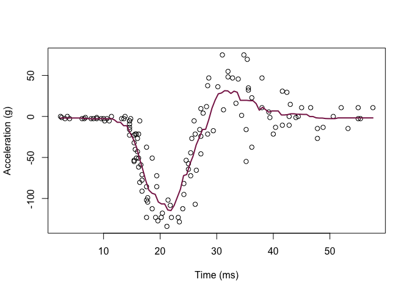
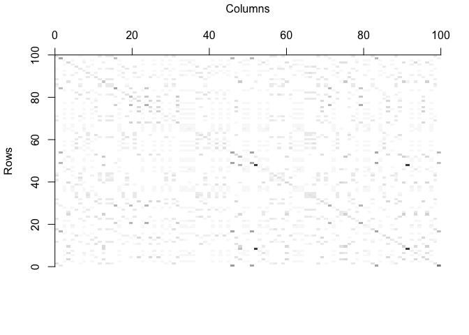
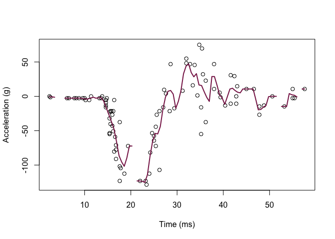
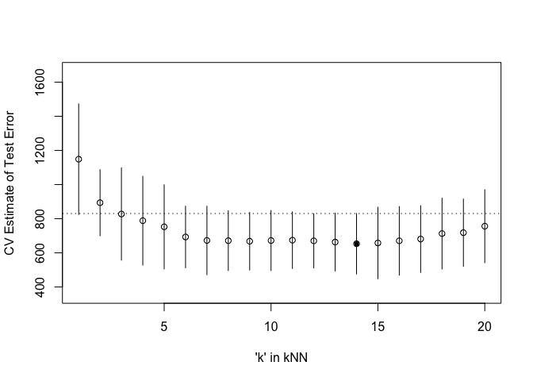

Homework 4
================
Qi Lin
February 25, 2023

``` r
library('MASS') ## for 'mcycle'
library('manipulate') ## for 'manipulate'
```

1.  Randomly split the mcycle data into training (75%) and validation
    (25%) subsets.

``` r
# data loading 
y <- mcycle$accel
x <- matrix(mcycle$times, length(mcycle$times), 1)

plot(x, y, xlab="Time (ms)", ylab="Acceleration (g)")
```

<!-- -->

``` r
# reproducible
set.seed(1)

# Create an index to randomly generate 75% out of default observations
index <- sample(nrow(mcycle),nrow(mcycle)*0.75)

# Training set is based on the random index generated above
train_x <- matrix(x[index, ])
# Testing set will be the original data minus the 80% training
test_x <- matrix(x[-index, ])

train_y <- y[index]
test_y <- y[-index]
```

2.  Using the mcycle data, consider predicting the mean acceleration as
    a function of time. Use the Nadaraya-Watson method with the k-NN
    kernel function to create a series of prediction models by varying
    the tuning parameter over a sequence of values. (hint: the script
    already implements this)

``` r
## Epanechnikov kernel function
## x  - n x p matrix of training inputs
## x0 - 1 x p input where to make prediction
## lambda - bandwidth (neighborhood size)
kernel_epanechnikov <- function(x, x0, lambda=1) {
  d <- function(t)
    ifelse(t <= 1, 3/4*(1-t^2), 0)
  z <- t(t(x) - x0)
  d(sqrt(rowSums(z*z))/lambda)
}

## k-NN kernel function
## x  - n x p matrix of training inputs
## x0 - 1 x p input where to make prediction
## k  - number of nearest neighbors
kernel_k_nearest_neighbors <- function(x, x0, k=1) {
  ## compute distance betwen each x and x0
  z <- t(t(x) - x0)
  d <- sqrt(rowSums(z*z))

  ## initialize kernel weights to zero
  w <- rep(0, length(d))
  
  ## set weight to 1 for k nearest neighbors
  w[order(d)[1:k]] <- 1
  
  return(w)
}

## Make predictions using the NW method
## y  - n x 1 vector of training outputs
## x  - n x p matrix of training inputs
## x0 - m x p matrix where to make predictions
## kern  - kernel function to use
## ... - arguments to pass to kernel function
nadaraya_watson <- function(y, x, x0, kern, ...) {
  k <- t(apply(x0, 1, function(x0_) {
    k_ <- kern(x, x0_, ...)
    k_/sum(k_)
  }))
  yhat <- drop(k %*% y)
  attr(yhat, 'k') <- k
  return(yhat)
}

## Helper function to view kernel (smoother) matrix
matrix_image <- function(x) {
  rot <- function(x) t(apply(x, 2, rev))
  cls <- rev(gray.colors(20, end=1))
  image(rot(x), col=cls, axes=FALSE)
  xlb <- pretty(1:ncol(x))
  xat <- (xlb-0.5)/ncol(x)
  ylb <- pretty(1:nrow(x))
  yat <- (ylb-0.5)/nrow(x)
  axis(3, at=xat, labels=xlb)
  axis(2, at=yat, labels=ylb)
  mtext('Rows', 2, 3)
  mtext('Columns', 3, 3)
}

# create a grid of inputs 
x_plot <- matrix(seq(min(x),max(x),length.out=100),100,1)

# make predictions using NW method at each of grid points
y_hat_plot_kernel_E <- nadaraya_watson(y, x, x_plot,
  kernel_epanechnikov, lambda=1)

y_hat_plot_KNN <- nadaraya_watson(y, x, x_plot,
  kern=kernel_k_nearest_neighbors, k=12) # set k = 12

# plot predictions
plot(x, y, xlab="Time (ms)", ylab="Acceleration (g)")
lines(x_plot, y_hat_plot_KNN, col="#882255", lwd=2)
```

<!-- -->

``` r
# how does k affect shape of predictor using k-nn kernel?
# using a slider 
# manipulate({
#   y_hat_plot <- nadaraya_watson(y, x, x_plot,
#     kern=kernel_k_nearest_neighbors, k=k_slider)
#   plot(x, y, xlab="Time (ms)", ylab="Acceleration (g)")
#   lines(x_plot, y_hat_plot, col="#882255", lwd=2) 
# }, k_slider=slider(1, 100, initial=1, step=1))
```

3.  With the squared-error loss function, compute and plot the training
    error, AIC, BIC, and validation error (using the validation data) as
    functions of the tuning parameter.

``` r
## Compute effective df using NW method
## y  - n x 1 vector of training outputs
## x  - n x p matrix of training inputs
## kern  - kernel function to use
## ... - arguments to pass to kernel function
effective_df <- function(y, x, kern, ...) {
  y_hat <- nadaraya_watson(y, x, x,
    kern=kern, ...)
  sum(diag(attr(y_hat, 'k')))
}

## loss function
## y    - train/test y
## yhat - predictions at train/test x
loss_squared_error <- function(y, yhat)
  (y - yhat)^2

## test/train error
## y    - train/test y
## yhat - predictions at train/test x
## loss - loss function
error <- function(y, yhat, loss=loss_squared_error)
  mean(loss(y, yhat))

## AIC
## y    - training y
## yhat - predictions at training x
## d    - effective degrees of freedom
aic <- function(y, yhat, d)
  error(y, yhat) + 2/length(y)*d

## BIC
## y    - training y
## yhat - predictions at training x
## d    - effective degrees of freedom
bic <- function(y, yhat, d)
  error(y, yhat) + log(length(y))/length(y)*d

## make predictions using NW method at training inputs
y_hat <- nadaraya_watson(train_y, train_x, train_x,
  kernel_epanechnikov, lambda=5)

## view kernel (smoother) matrix
matrix_image(attr(y_hat, 'k'))
```

<!-- -->

``` r
## compute effective degrees of freedom
edf <- effective_df(train_y, train_x, kernel_epanechnikov, lambda=5)
aic = aic(train_y, y_hat, edf)
bic = bic(train_y, y_hat, edf)
training_error = error(train_y, y_hat)

# calculate validation error (using the validation data)
y_hat_validation <- nadaraya_watson(test_y, test_x, test_x,
  kernel_epanechnikov, lambda=5)

validation_error = error(test_y, y_hat_validation)

## create a grid of inputs 
x_plot <- matrix(seq(min(train_x),max(train_x),length.out=100),100,1)

## make predictions using NW method at each of grid points
y_hat_plot <- nadaraya_watson(train_y, train_x, x_plot,
  kernel_epanechnikov, lambda=1)

## plot predictions
plot(train_x, train_y, xlab="Time (ms)", ylab="Acceleration (g)")
lines(x_plot, y_hat_plot, col="#882255", lwd=2) 
```

<!-- -->

-   Training error = 774.9515796
-   AIC = 775.1250007
-   BIC = 775.350025
-   Validation error = 482.2520361

4.  For each value of the tuning parameter, Perform 5-fold
    cross-validation using the combined training and validation data.
    This results in 5 estimates of test error per tuning parameter
    value.

``` r
library('caret') ## 'knnreg' and 'createFolds'

## 5-fold cross-validation of knnreg model
## create five folds
set.seed(1985)
accel_flds  <- createFolds(mcycle$accel, k=5)
# print(accel_flds)
sapply(accel_flds, length)  ## not all the same length
```

    ## Fold1 Fold2 Fold3 Fold4 Fold5 
    ##    26    28    26    27    26

``` r
cvknnreg <- function(kNN = 10, flds=accel_flds) {
  cverr <- rep(NA, length(flds))
  for(tst_idx in 1:length(flds)) { ## for each fold
    
    ## get training and testing data
    accel_train <- mcycle[-flds[[tst_idx]],]
    accel_test <- mcycle[ flds[[tst_idx]],]
    
    ## fit kNN model to training data
    knn_fit <- knnreg(accel ~ times,
                      k=kNN, data=accel_train)
    
    ## compute test error on testing data
    pre_tst <- predict(knn_fit, accel_test)
    cverr[tst_idx] <- mean((accel_test$accel - pre_tst)^2)
  }
  return(cverr)
}

## Compute 5-fold CV for kNN = 1:20
cverrs <- sapply(1:20, cvknnreg)
#print(cverrs) ## rows are k-folds (1:5), cols are kNN (1:20)
(cverrs_mean <- apply(cverrs, 2, mean))
```

    ##  [1] 1148.6878  893.7742  827.4059  788.4628  752.4719  692.9640  672.6004
    ##  [8]  671.4503  668.0925  672.2806  674.2506  670.1368  663.2182  653.3462
    ## [15]  657.8143  670.4524  680.9193  712.7899  718.2471  756.1442

``` r
(cverrs_sd   <- apply(cverrs, 2, sd))
```

    ##  [1] 323.9170 193.3384 270.1437 260.0876 246.1653 180.3066 200.5957 175.4164
    ##  [9] 168.5319 175.8767 165.8335 158.5756 169.1695 177.0681 209.4268 200.8906
    ## [17] 195.4782 207.5741 196.9763 213.5736

5.  Plot the CV-estimated test error (average of the five estimates from
    each fold) as a function of the tuning parameter. Add vertical line
    segments to the figure (using the segments function in R) that
    represent one “standard error” of the CV-estimated test error
    (standard deviation of the five estimates from each fold).

``` r
## Plot the results of 5-fold CV for kNN = 1:20
plot(x=1:20, y=cverrs_mean, 
     ylim=range(cverrs),
     xlab="'k' in kNN", ylab="CV Estimate of Test Error")
segments(x0=1:20, x1=1:20,
         y0=cverrs_mean-cverrs_sd,
         y1=cverrs_mean+cverrs_sd)
best_idx <- which.min(cverrs_mean)
points(x=best_idx, y=cverrs_mean[best_idx], pch=20)
abline(h=cverrs_mean[best_idx] + cverrs_sd[best_idx], lty=3)
```

<!-- -->

6.  Interpret the resulting figures and select a suitable value for the
    tuning parameter.

Minimum test error occurs when k = 14, we select k = 20 because it is
one standard deviation away from the minimum but with the highest k
value.
